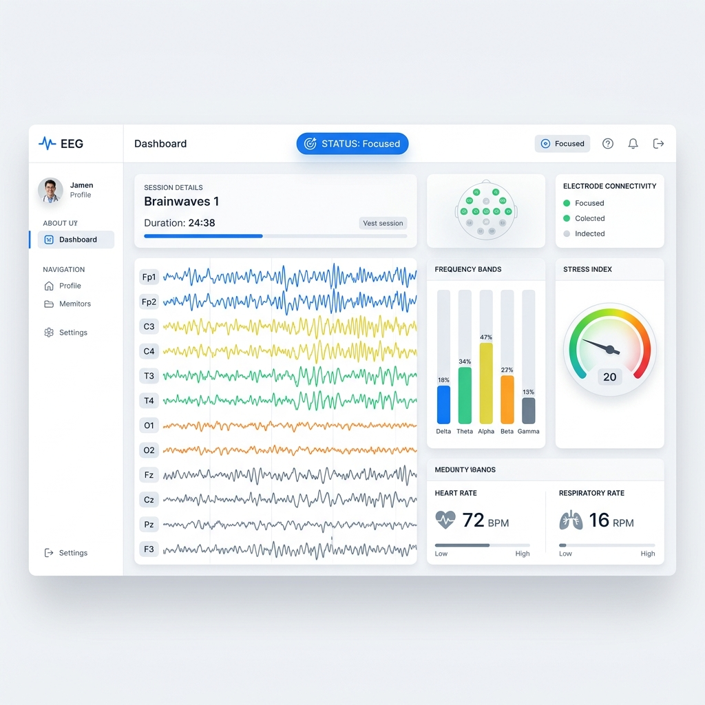

# ⬡ WaveForm — EEG Brain Monitor

[](https://opensource.org/licenses/MIT)
[](https://www.python.org/)
[](https://share.streamlit.io/)
[](https://github.com/d3mio/Waveform1.0)

> **Real-time EEG acquisition, signal processing, ML inference, and session logging — from electrode to dashboard.**



WaveForm is a full-stack brain-computer interface (BCI) system built on an **ESP32 + ADS1115 + AD8232** hardware stack, streamed over USB serial or wireless network to a **Streamlit** web dashboard. It decodes five EEG frequency bands in real-time, infers mental state via three scikit-learn classifiers, and logs every session to a local **SQLite** database or cloud **Supabase** instance.

---

### Live Demo & Deployments
- **Live Interactive Demo**: [waveform-eeg.streamlit.app](https://waveform-eeg.streamlit.app) (Running in simulation/demo mode)
- **Deployment Platform**: Deployed seamlessly on [Streamlit Community Cloud](https://share.streamlit.io/) and accessible on any device.

### Repository Topics & Tags
`eeg` · `brain-computer-interface` · `esp32` · `streamlit` · `signal-processing` · `scikit-learn` · `machine-learning` · `biosensors` · `medical-devices` · `python` · `firmware` · `data-visualization`

---

## Table of Contents

1. [System Overview](#system-overview)
2. [Hardware](#hardware)
3. [Software Architecture](#software-architecture)
4. [Dashboard Pages](#dashboard-pages)
5. [Machine Learning Models](#machine-learning-models)
6. [Database Schema](#database-schema)
7. [Serial Protocol](#serial-protocol)
8. [Project Structure](#project-structure)
9. [Requirements](#requirements)
10. [Quick Start](#quick-start)
11. [Wiring Reference](#wiring-reference)
12. [Configuration](#configuration)
13. [Data Export](#data-export)

---

## System Overview

```
[ Electrodes ]
      │  analog EEG signal
      ▼
[ AD8232 ]  ← biopotential amplifier / filter
      │  amplified analog
      ▼
[ ADS1115 ] ← 16-bit ADC, I²C, 250 SPS
      │  I²C (SDA GPIO21, SCL GPIO22)
      ▼
[ ESP32 ]   ← samples at 200 Hz, streams over USB serial
      │  USB-Serial @ 115200 baud
      ▼
[ signal_engine.py ]
      │  bandpass 0.5–45 Hz + 50 Hz notch → FFT → band powers
      ▼
[ ml_engine.py ]
      │  Random Forest / Gradient Boosting
      ▼
[ Streamlit Dashboard ]  ← http://localhost:8501
      │
      ▼
[ SQLite — data/waveform.db ]
```

---

## Hardware

| Component | Role |
|---|---|
| **ESP32** | Microcontroller — samples ADS1115 via I²C at 200 Hz, streams over USB serial |
| **ADS1115** | 16-bit external ADC (I²C, 0x48) — provides 125 µV/bit resolution at ±4.096 V gain |
| **AD8232** | Single-lead biopotential (EEG/ECG) amplifier and bandpass filter module |
| **3 × Wet Electrodes** | Placed on scalp/forehead — RA, LA, RL leads |

### Key Hardware Parameters

| Parameter | Value |
|---|---|
| ADC resolution | 16-bit signed (max 32767) |
| ADC gain | GAIN_ONE — ±4.096 V full-scale, **≈125 µV/bit** |
| ADS1115 sample rate | 250 SPS (≥ 200 Hz target) |
| Baud rate | 115200 |
| Lead-off detection pins | GPIO 2 (LO+), GPIO 4 (LO−) |
| I²C pins | SDA = GPIO 21, SCL = GPIO 22 |

---

## Software Architecture

### `app.py` — Streamlit Entry Point

- Sets page config (wide layout, `⬡` favicon)
- Loads and injects `dashboard/style.css`
- Initialises three cached singleton resources: `SignalEngine`, `MLEngine`, `database`
- Manages session state: `history` DataFrame (last 300 ticks), `session_log`, `running`, `ml_result`
- Drives the main data tick loop: calls `engine.tick()` → extracts bands → runs ML → writes to DB every 20 ticks (~1 s)
- Auto-reruns every **~80 ms** while live (`time.sleep(0.08)` + `st.rerun()`)
- Routes to five pages via `st.session_state.page`

---

### `dashboard/signal_engine.py` — Signal Engine

The `SignalEngine` class is the real-time DSP core.

**Two operating modes:**

| Mode | Description |
|---|---|
| **Live** | Reads raw 16-bit signed integers from USB serial, normalises to 0–1023 range |
| **Demo** | Synthesises realistic multi-band EEG with three 10-second mood cycles: Relaxed → Focused → Stressed |

**Signal pipeline (per tick, n=20 samples):**
1. Read/synthesise raw samples
2. Append to a 400-sample ring buffer (`collections.deque`)
3. Butterworth **bandpass 0.5–45 Hz** (order 4)
4. **IIR notch at 50 Hz** (Q=30) for mains interference rejection
5. Compute **FFT** (`scipy.fft`) and extract band power via frequency-domain integration

**EEG Frequency Bands:**

| Band | Range | Colour |
|---|---|---|
| Delta (δ) | 0.5–4 Hz | Indigo |
| Theta (θ) | 4–8 Hz | Cyan |
| Alpha (α) | 8–12 Hz | Emerald |
| Beta (β) | 13–30 Hz | Amber |
| Gamma (γ) | 30–45 Hz | Red |

**Derived metrics:**

| Metric | Formula |
|---|---|
| Stress Index | β / (α + ε) |
| Brain State | Relaxed (<1.2) → Focused (<2.5) → Alert (<4.0) → Stressed (≥4.0) |

**Serial handshake detection:** parses `WAVEFORM_START`, `ADC_MAX:<int>`, `FS:<int>` on connect. Reads `RATE:<ms>` diagnostics every 200 samples and flags if rate deviates beyond ±10% of 1000 ms.

---

### `dashboard/ml_engine.py` — ML Inference Engine

Three scikit-learn classifiers trained on **9 synthetic EEG profiles × 300 samples** each (2700 total samples).

#### Feature Vector (10 features)

```
[delta, theta, alpha, beta, gamma,
 theta/alpha,   ← drowsiness ratio
 beta/alpha,    ← stress/alertness ratio
 alpha/total,   ← relaxation ratio
 delta/beta,    ← sleep pressure ratio
 (beta-alpha)/total]  ← depression asymmetry marker
```

#### Classifiers

| Classifier | Algorithm | Labels |
|---|---|---|
| **Stress** | Random Forest (120 trees) | Low · Moderate · High |
| **Depression** | Gradient Boosting (100 estimators) | Minimal · Mild · Moderate · Severe |
| **Emotion** | Random Forest (120 trees) | Calm · Happy · Anxious · Sad · Focused · Fatigued |

All classifiers are wrapped in a `StandardScaler → Classifier` sklearn `Pipeline` and saved to `models/` as `.joblib` files. On startup, models are loaded from disk; if missing or stale, they are retrained automatically.

A **rule-based fallback** is used if training fails: stress inferred from β/α ratio, depression from raw alpha amplitude.

---

### `dashboard/database.py` — SQLite Storage Layer

Database lives at `data/waveform.db`.

**Tables:**

| Table | Description |
|---|---|
| `sessions` | One row per monitoring session (label, timestamps, sample rate) |
| `eeg_snapshots` | Periodic (~1 s) rows: all 5 band powers + stress index + all ML labels + confidence scores |
| `raw_samples` | Optional high-rate raw ADC values |
| `annotations` | User-added timestamped labels and notes |

**Key functions:**

| Function | Purpose |
|---|---|
| `init_db()` | CREATE TABLE IF NOT EXISTS for all tables |
| `create_session(label)` | Insert session row, return session_id |
| `insert_snapshot(...)` | Write 1-second EEG + ML snapshot |
| `load_snapshots(session_id)` | Return DataFrame for one session |
| `load_all_snapshots()` | Return last 5000 rows across all sessions |
| `export_session_csv(session_id)` | Write CSV to `data/exports/` |
| `add_annotation(session_id, label, note)` | Attach user annotation |

---

### `dashboard/components.py` — UI Components

All Streamlit UI components. Uses a **clinical white theme** with blue accents (`#2563eb`), rendered with Plotly.

| Component | Description |
|---|---|
| `render_header()` | Top bar: title, live/standby dot, clock |
| `render_sidebar()` | Port scanner, connect/disconnect, navigation, session stats, reset |
| `render_standby()` | Placeholder screen when no device connected |
| `render_metric_cards()` | 6 cards: δ θ α β γ powers + stress index |
| `render_eeg_waveform()` | Scrolling time-domain EEG + rolling envelope |
| `render_fft_spectrum()` | Filled area FFT plot, coloured per band |
| `render_band_bars()` | Vertical bar chart of band powers |
| `render_stress_gauge()` | Plotly gauge indicator (0–8 SI), colour-coded zones |
| `render_brain_state_panel()` | State emoji + label + progress bar |
| `render_history_chart()` | Multi-trace band power history (last 300 ticks) |
| `render_session_log()` | Last 10 log entries: time, state, SI, alpha |
| `render_ml_panel()` | 3 ML result cards + stress probability bar chart |
| `render_database_panel()` | Session list, snapshot viewer, CSV export, stored history chart |
| `render_analytics_panel()` | Emotion pie chart, stress bar chart, stress-over-time multi-session chart |
| `render_arduino_setup_panel()` | Full wiring table + diagnostic tools |

---

### `dashboard/style.css` — Styling

Medical minimal design language:
- Pure white background (`#ffffff`), slate text palette
- Blue accent `#2563eb`
- Components: `.wf-header`, `.wf-card`, `.metric-card`, `.ml-card`, `.conn-badge`, `.wf-progress`, `.log-row`
- Animated pulsing dots: `.live-dot` (green), `.standby-dot` (grey)
- Font: **Inter** (via system font stack)

---

### `waveform.sh` — Shell Controller

A Bash launcher that orchestrates the full system.

```bash
# Modes
./waveform.sh           # interactive REPL (start / stop / exit)
./waveform.sh start     # upload sketch + start dashboard
./waveform.sh stop      # kill all WaveForm processes
```

**`start` sequence:**
1. `arduino-cli upload` — flash `waveform_eeg_bridge.ino` to ESP32 (auto-retries once on failure)
2. 2-second boot wait
3. `streamlit run app.py` on port 8501 (background)
4. Prints dashboard URL and waits for `stop` command

**Configuration at top of script:**
```bash
PORT="/dev/cu.usbserial-0001"
FQBN="esp32:esp32:esp32"
SKETCH="arduino/waveform_eeg_bridge"
```

---

### `arduino/waveform_eeg_bridge/waveform_eeg_bridge.ino` — Firmware

Arduino sketch for ESP32.

- Initialises ADS1115 at 0x48 (I²C) with `GAIN_ONE` and `RATE_ADS1115_250SPS`
- Sends startup handshake: `WAVEFORM_START` / `ADC_MAX:32767` / `FS:200`
- Timer-driven sample loop at exactly **5000 µs intervals (200 Hz)**
- Checks lead-off detection pins (GPIO 2 / 4): if electrodes disconnected, sends mid-scale `16383`
- Every 200 samples, prints `RATE:<elapsed_ms>` — timing diagnostic for the Python dashboard
- Libraries required: `Adafruit ADS1X15`, `Adafruit BusIO`

---

## Dashboard Pages

| Page | Key Content |
|---|---|
| **Live Monitor** | Metric cards → EEG waveform → FFT spectrum → Band bars → Stress gauge → History chart → Brain state → Session log |
| **ML Analysis** | Metric cards → ML inference cards (stress/depression/emotion) → EEG waveform → Brain state → History → Model info table |
| **Database** | Session list → Snapshot viewer (last 50 rows) → CSV export → Stored history chart → Add annotation form |
| **Analytics** | Emotion distribution pie → Stress distribution bar → Stress index over time (last 5 sessions) |
| **Device Setup** | Full wiring table → Port diagnostic → Flash instructions |

---

## Machine Learning Models

Models are stored in `models/` and versioned with a `_v2` suffix. Bump `MLEngine._VERSION` to force a rebuild.

```
models/
├── stress_v2.joblib       (~2.7 MB)
├── depression_v2.joblib   (~505 KB)
└── emotion_v2.joblib      (~6.5 MB)
```

Training profiles used (synthetic ground truth):

| Profile | δ | θ | α | β | γ | Stress | Depression | Emotion |
|---|---|---|---|---|---|---|---|---|
| Calm | 60 | 25 | 55 | 15 | 8 | Low | Minimal | Calm |
| Happy | 50 | 30 | 45 | 25 | 10 | Low | Minimal | Happy |
| Anxious | 35 | 40 | 20 | 70 | 20 | High | Mild | Anxious |
| Sad | 65 | 48 | 18 | 20 | 6 | Moderate | Moderate | Sad |
| Focused | 45 | 35 | 30 | 45 | 15 | Moderate | Minimal | Focused |
| Fatigued | 70 | 45 | 22 | 22 | 7 | Moderate | Moderate | Fatigued |
| High Stress | 30 | 38 | 18 | 80 | 22 | High | Mild | Anxious |
| Mild Dep. | 62 | 42 | 15 | 25 | 8 | Moderate | Moderate | Sad |
| Severe Dep. | 70 | 50 | 10 | 30 | 5 | High | Severe | Sad |

---

## Database Schema

```sql
CREATE TABLE sessions (
    id          INTEGER PRIMARY KEY AUTOINCREMENT,
    started_at  TEXT,
    ended_at    TEXT,
    label       TEXT,
    notes       TEXT,
    fs          INTEGER DEFAULT 200
);

CREATE TABLE eeg_snapshots (
    id               INTEGER PRIMARY KEY AUTOINCREMENT,
    session_id       INTEGER REFERENCES sessions(id),
    ts               TEXT,
    elapsed_sec      REAL,
    delta            REAL,
    theta            REAL,
    alpha            REAL,
    beta             REAL,
    gamma            REAL,
    stress_index     REAL,
    stress_label     TEXT,
    stress_conf      REAL,
    depression_label TEXT,
    depression_conf  REAL,
    emotion_label    TEXT,
    emotion_conf     REAL
);

CREATE TABLE raw_samples (
    id          INTEGER PRIMARY KEY AUTOINCREMENT,
    session_id  INTEGER REFERENCES sessions(id),
    ts          TEXT,
    sample_idx  INTEGER,
    value       REAL
);

CREATE TABLE annotations (
    id          INTEGER PRIMARY KEY AUTOINCREMENT,
    session_id  INTEGER REFERENCES sessions(id),
    ts          TEXT,
    label       TEXT,
    note        TEXT
);
```

---

## Serial Protocol

```
──── Startup (once on boot) ────
WAVEFORM_START
ADC_MAX:32767
FS:200

──── Per-sample (200 Hz) ───────
<integer>       ← signed 16-bit ADC value, one per line

──── Diagnostics (~every 1 s) ──
RATE:<elapsed_ms>   ← should be ~1000; flagged if outside 900–1100 ms
```

---

## Project Structure

```
Waveform-1.0/
├── app.py                          # Streamlit app entry point
├── waveform.sh                     # Bash controller (upload + launch)
├── requirements.txt                # Python dependencies
├── instructions.txt                # Quick-start notes
│
├── arduino/
│   └── waveform_eeg_bridge/
│       └── waveform_eeg_bridge.ino # ESP32 firmware (ADS1115 + AD8232)
│
├── dashboard/
│   ├── __init__.py
│   ├── signal_engine.py            # DSP: bandpass, notch, FFT, band powers
│   ├── ml_engine.py                # ML: stress / depression / emotion inference
│   ├── database.py                 # SQLite storage layer
│   ├── components.py               # All Streamlit UI components
│   └── style.css                   # Clinical white theme CSS
│
├── models/
│   ├── stress_v2.joblib
│   ├── depression_v2.joblib
│   └── emotion_v2.joblib
│
└── data/
    └── waveform.db                 # SQLite database (auto-created)
```

---

## Requirements

```
streamlit>=1.32.0
plotly>=5.18.0
numpy>=1.26.0
scipy>=1.12.0
pandas>=2.2.0
scikit-learn>=1.4.0
joblib>=1.3.0
pyserial>=3.5
```

Install all:
```bash
pip install -r requirements.txt
```

---

## Quick Start

### Option A — Using the Shell Controller (recommended)

```bash
# 1. Clone / open the project
cd Waveform-1.0

# 2. Set up Python environment
python3 -m venv .venv
source .venv/bin/activate
pip install -r requirements.txt

# 3. Install arduino-cli (if not already installed)
brew install arduino-cli
arduino-cli core install esp32:esp32
arduino-cli lib install "Adafruit ADS1X15" "Adafruit BusIO"

# 4. Edit waveform.sh — set your serial port and board FQBN
# PORT="/dev/cu.usbserial-XXXX"
# FQBN="esp32:esp32:esp32"

# 5. Launch everything
chmod +x waveform.sh
./waveform.sh start
```

Dashboard opens at **http://localhost:8501**

In the sidebar: select the port → **Connect**.

### Option B — Dashboard Only (no hardware)

```bash
source .venv/bin/activate
streamlit run app.py
```

The dashboard starts in **Demo mode** (synthesised EEG, cycles Relaxed → Focused → Stressed every 10 s). Connect a real device from the sidebar to switch to live data.

---

## Wiring Reference

| From | To | Note |
|---|---|---|
| ESP32 3V3 | Power rail (+) | 3.3V supply |
| ESP32 GND | Ground rail (−) | Common GND |
| ADS1115 VDD | Power rail (+) | 3.3V |
| ADS1115 GND | Ground rail (−) | GND |
| ADS1115 ADDR | Ground rail (−) | I²C address → 0x48 |
| ADS1115 SDA | ESP32 GPIO 21 | I²C data |
| ADS1115 SCL | ESP32 GPIO 22 | I²C clock |
| ADS1115 A0 | AD8232 OUTPUT | EEG signal input |
| AD8232 VIN | Power rail (+) | 3.3V |
| AD8232 GND | Ground rail (−) | GND |
| AD8232 SDN | Power rail (+) | Keep sensor ON |
| AD8232 OUTPUT | ADS1115 A0 | EEG signal |
| AD8232 LO+ | ESP32 GPIO 2 | Lead-off detection |
| AD8232 LO− | ESP32 GPIO 4 | Lead-off detection |

**Electrode placement:** Standard single-channel frontal EEG (Fp1/Fp2/FpZ) or forehead placement for best signal quality.

---

## Configuration

### `waveform.sh`

```bash
PORT="/dev/cu.usbserial-0001"   # your ESP32 USB-serial port
FQBN="esp32:esp32:esp32"         # your board's Fully Qualified Board Name
SKETCH="arduino/waveform_eeg_bridge"
VENV=".venv/bin"
APP="app.py"
```

### `signal_engine.py`

| Parameter | Default | Description |
|---|---|---|
| `fs` | 200 Hz | Sample rate |
| `buffer_size` | 400 | Ring buffer size (2 seconds) |
| `baud` | 115200 | Serial baud rate |
| `demo` | True | Start in demo mode |

### ML Model Versioning

To force model rebuild (e.g. after changing training data):

```python
# In ml_engine.py
class MLEngine:
    _VERSION = "v3"   # bump this
```

---

## Data Export

From the **Database** page, select a session and click **Export to CSV**.

Export is saved to:
```
data/exports/session_<id>.csv
```

The CSV contains all columns from `eeg_snapshots`: timestamp, elapsed seconds, all five band powers, stress index, and all ML labels with confidence scores.

---

## Version

**WaveForm v1.0** · ICECAP-Lite  
Hardware: ESP32 + ADS1115 + AD8232  
Dashboard: Streamlit · Plotly · scikit-learn · SQLite
